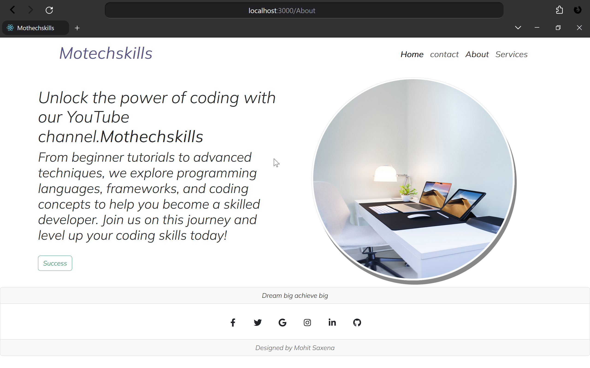
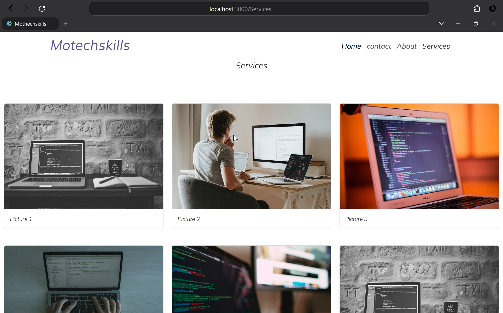

# Mohit Saxena's Personal Project

This is a personal project by Mohit Saxena, built for the purpose of learning web development and exploring the intricacies of React.

## Screenshots

Get a quick glance of the project with these screenshots:

1. 
2. 
3. 
4. 
5. 

## Getting Started

Follow these instructions to get the project up and running on your local machine:

### Prerequisites

Ensure you have the following installed:
- [Node.js](https://nodejs.org/)
- [npm](https://www.npmjs.com/)

### Installation

1. Clone the repository:
   ```
   git clone [Your Repo URL Here]
   ```

2. Navigate into the project directory:
   ```
   cd [Your Repo Directory]
   ```

3. Install the required dependencies:
   ```
   npm install
   ```

4. Start the development server:
   ```
   npm start
   ```

The application should now be running on `http://localhost:3000/`. Open it in a browser to view the app.

## Feedback

I'm always open to feedback and looking to improve. Feel free to drop suggestions, issues, or even pull requests!

```

You can customize it further as needed. Just ensure you replace placeholders like `[Your Repo URL Here]` with your actual repository URL and `[Your Repo Directory]` with your actual repository directory name if they are not the default ones.